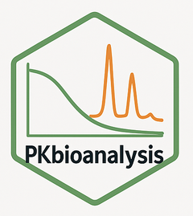

# PKbioanalysis 

<!-- badges: start -->
[](https://github.com/OmarAshkar/PKbioanalysis/actions/workflows/R-CMD-check.yaml)
<!-- badges: end -->

[](https://cran.r-project.org/package=PKbioanalysis)
[](https://cran.r-project.org/package=PKbioanalysis)
[](https://cran.r-project.org/package=PKbioanalysis)

**PKbioanalysis** is a comprehensive R package designed to streamline pharmacokinetic (PK) and bioanalytical workflows from study design through data analysis and reporting. Built on regulatory best practices and [FAIR principles](https://www.nature.com/articles/sdata201618), it provides an integrated solution for managing bioanalytical experiments with persistent data storage, interactive visualizations, and AI-assisted quality control.

---

## ✨ Key Features

### 📊 Study Management & Design
- **Comprehensive trial management system** with relational database architecture (DuckDB)
- **Study design tools** for common PK studies such as single-dose (SD), multiple-dose (MD), food-effect (FE), and bioequivalence (BE) studies along with In Vitro studies support
- **Subject tracking** with dosing schedules, sampling timepoints, and metadata management
- **Sample log integration** linking bioanalytical data to study design

### 🧪 Bioanalytical Workflows
- **96-well plate design and visualization** with flexible filling schemes (horizontal/vertical)
- **Automated injection sequence generation** compatible with major LC-MS platforms
- **Vendor support**: MassLynx, MassHunter, Analyst
- **Interactive chromatogram integration** with manual and automated peak detection
- **Quality control (QC) Assessment** using regulatory-compliant criteria 
- **Suitability assessment** for instrument equilibration monitoring
- **Linearity evaluation** with interactive visualization and regulatory-compliant reporting

### 📈 Data Analysis & Export
- **Maximum likelihood estimation (MLE)** of additive and proportional errors
- **Interactive dilution scheme** with automatic unit conversion
- **PKmerge functionality** to combine bioanalytical results with study metadata
- **NONMEM-ready export** with numeric recoding and codebook generation
- **Precision and accuracy** calculations per analytical batch

### 🤖 AI Capabilities
- **AI-assisted chromatogram integration** with automated peak boundary detection
- **Intelligent quality assessment** for linearity, suitability, and study design
- **Conversational AI assistant** for method troubleshooting and data interpretation
- **Regulatory compliance checks** with automated flagging of potential issues

---

## 📦 Installation

### GUI-Only Installation (No Coding Required)

PKbioanalysis provides modular Shiny applications for study management (`study_app()`), chromatography processing (`chrom_app()`), and quantification (`quant_app()`). These run locally with persistent data storage.

#### Windows Users
1. Download the installer and shortcuts from [Google Drive](https://drive.google.com/file/d/1jc927mIbMzTe7hrW6g_1ANy5m28fWE9A/view?usp=drive_link)
2. Run `install_PKbioanalysis.bat` to install the package
3. Use the desktop shortcuts:
   - `study_app.bat` - Study design and sample management
   - `chrom_app.bat` - Chromatogram integration
   - `quant_app.bat` - Quantification and linearity

### R Package Installation

For users comfortable with R programming:

**Stable Release (CRAN)**
```R
install.packages("PKbioanalysis")
```

**Development Version (GitHub)**
```R
# Install remotes if needed
install.packages("remotes")

# Install PKbioanalysis from GitHub
remotes::install_github("OmarAshkar/PKbioanalysis")
```

### Optional: Python Dependencies

For advanced chromatography file parsing (Waters `.raw` files):
```R
PKbioanalysis::install_py_dep()
```
This creates a virtual environment with required Python packages (`pandas`, `rainbow-api`, `numpy`, `scipy`).


## 🚀 Quick Start

```R
library(PKbioanalysis)

# Study design and management
study_app()

# Chromatogram integration
chrom_app()

# Quantification, linearity assessment, residual error estimation, and PK dataset generation
quant_app()
```


## 🤖 AI Capabilities & Configuration

PKbioanalysis integrates AI-powered quality assessment and decision support throughout the bioanalytical workflow.

### Supported AI Features

#### 1. **Automated Chromatogram Integration**
- AI analyzes chromatographic traces to detect peak boundaries
- Identifies retention time, peak start/end, and signal-to-noise ratio
- Flags problematic peaks with detailed comments
- Validates peak shape and width according to analytical standards

#### 2. **Linearity Assessment Assistant**
- Reviews calibration curve statistics
- Identifies outliers and recommends exclusions
- Checks intercept significance and heteroscedasticity (recommends weighting if needed)
- Provides regulatory compliance feedback

#### 3. **Suitability Evaluation**
- Analyzes instrument response stabilization across runs
- Calculates equilibration time based on CV% trends
- Flags experimental issues (insufficient replicates, high variability)

#### 4. **Study Design Review**
- Evaluates randomization, blocking, and control groups
- Suggests improvements for sampling strategy
- Assesses balance and potential confounding factors in the design

#### 5. **Plate Design Optimization**
- Reviews QC distribution and calibration curve coverage
- Checks for appropriate controls (blanks, suitability samples)
- Validates replicate strategy

#### 6. **Injection List Quality Control**
- Analyzes run order and blank placement
- Identifies potential carryover risks
- Suggests optimization for batch structure

### AI Configuration

PKbioanalysis uses **OpenAI-compatible** APIs (including local models via Ollama or cloud providers).

#### Setup via GUI
1. Launch any app (`study_app()`, `chrom_app()`, or `quant_app()`)
2. Click the **⚙️ Configure Settings** button
3. Enter your configuration:
   - **API Base URL**: `https://api.openai.com/v1` or your local endpoint
   - **API Key**: Your OpenAI API key (or leave blank for local models)
   - **AI Model**: Choose from supported models
   - **Temperature**: Control response randomness (0.0 = deterministic, 1.0 = creative)

#### Setup Programmatically
```R
# Update configuration
PKbioanalysis::update_config(
  base_url = "https://api.openai.com/v1",
  api_key = Sys.getenv("OPENAI_API_KEY"),  # Or set in .Renviron
  model = "gpt-4",
  temperature = 0.5
)

# Refresh to apply changes
PKbioanalysis::refresh_config()

# Check current settings
PKbioanalysis::get_pkbioanalysis_option("ai_model")
```

#### Supported Models
The package supports any OpenAI-compatible model, including:
- **OpenAI**: `gpt-4`, `gpt-3.5-turbo`
- **Open-source via Ollama/LM Studio**: `llama-3.1-70b-instruct`, `mistral-7b-instruct`, `codestral-22b`
- **Cloud providers**: `gemma-3-27b-it`, `granite-3.3-8b-instruct`

#### Environment Variables (Alternative Setup)
```bash
# In .Renviron file
OPENAI_API_KEY=your_api_key_here
```

#### Using Local Models (Privacy-First)
For organizations requiring data privacy:
1. Install [Ollama](https://ollama.com) or [LM Studio](https://lmstudio.ai)
2. Download a model (e.g., `ollama pull llama3.1:70b`)
3. Configure PKbioanalysis:
```R
update_config(
  base_url = "http://localhost:11434/v1",  # Ollama default
  api_key = "not-needed",  # Local models don't need keys
  model = "llama3.1:70b"
)
```

### AI Usage Tips
- **Higher temperature** (0.7-1.0) for creative suggestions and exploratory analysis
- **Lower temperature** (0.0-0.3) for consistent, deterministic quality checks
- **Larger models** (70B parameters) for complex regulatory assessments
- **Smaller models** (7-8B parameters) for routine peak integration and QC


## Documentation & Resources

- **Package Website**: [https://omarashkar.github.io/PKbioanalysis/](https://omarashkar.github.io/PKbioanalysis/)

## Architecture

PKbioanalysis uses a relational database (DuckDB) to maintain study integrity:

```
Study Design → Plate Design → Injection Sequences → Chromatography → Quantification
     ↓              ↓                 ↓                   ↓              ↓
  Subjects      Samples           File List           Peak Data    Concentrations
     ↓              ↓                 ↓                   ↓              ↓
  Dosing         Metadata          Database           Linearity      PK Datasets
```

<!-- All data persists in `tools::R_user_dir("PKbioanalysis", "data")` with automatic backups. -->

## License

AGPL-3.0 or later. See details.
